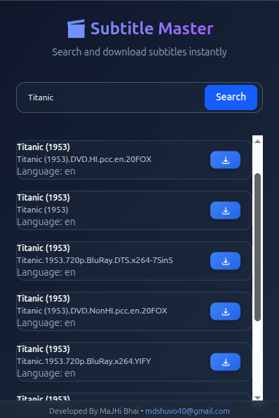

# Subtitle Downloader Pro – Firefox Extension

<!-- PROJECT LOGO -->
<p align="center">
  <!-- Replace this with your logo path -->
  
</p>

Subtitle Downloader Pro is a lightweight and efficient browser extension that lets you search and download subtitles instantly using the official OpenSubtitles API.
Designed for simplicity and speed, it helps you find accurate subtitles for movies, TV shows, anime, and more — with just one click.

---

## Screenshot

<!-- Replace this with your actual screenshot path -->
<p align="center">
  
</p>

---

## Features

- 🔍 Instant subtitle search by movie name, show name, season/episode, or keyword  
- ⬇️ One-click subtitle download (SRT format)  
- ⚡ Powered by OpenSubtitles API for fast and reliable results  
- 🎨 Clean UI built with TailwindCSS  
- 📦 Lightweight extension with minimal permissions  
- 💾 Uses Chrome Storage & Downloads APIs  
- 💯 Works on all Chromium-based browsers (Chrome, Edge, Brave, etc.)[web:21]

---

## Project Structure

```
subtitle-downloader/
│── background.js
│── popup.html
│── popup.js
│── manifest.json
│── styles.css
│── tailwind.css
│── input.css
│── icon16.png
│── icon48.png
│── icon128.png
│── README.md
│── package.json
│── package-lock.json
│── node_modules/
│── assets/
│ ├── logo.png 
│ └── screenshot.png 

```

---

## 🦊 Firefox Installation (Developer Mode)

Firefox still relies heavily on Manifest V2 but supports much of the Manifest V3 syntax when used together with the browser polyfill.  
This extension can run in Firefox after adding a 
- `browser_specific_settings` block to `manifest.json` and making sure `browser-polyfill.js` is loaded in your scripts.

### Load as Temporary Add-on

1. Open Firefox and navigate to:  
   `about:debugging#/runtime/this-firefox`
2. Click **Load Temporary Add-on…**
3. In the file picker, select the `manifest.json` file inside your project folder.
4. The extension will be installed temporarily and will remain active until Firefox is closed.

### Firefox Packaging (Optional)

To build a distributable `.xpi` for Firefox Add-ons (AMO):
```
npm install --global web-ext
web-ext build
```

The generated `.xpi` file in the `web-ext-artifacts` directory can be submitted to Firefox Add-ons (AMO) for publishing.

---

## Usage

1. Click the **Subtitle Downloader Pro** icon in the browser toolbar.  
2. Enter a movie name, TV show name with season/episode, or any keyword.  
3. Browse the subtitles returned from OpenSubtitles.  
4. Click **Download** next to a subtitle to save it as an SRT file via Chrome’s Downloads API.[web:21]

---

## How It Works

- The popup UI collects the user’s search query.  
- The query is sent to the background service worker.  
- The service worker communicates with the OpenSubtitles REST API and fetches matching subtitles.  
- When a result is selected, the service worker triggers a direct SRT download.[web:21]

---

## Manifest (Current Version)

```
{
  "manifest_version": 3,
  "name": "Subtitle Downloader Pro",
  "version": "1.0.2",

  "author": "Maizied Hasan Majumder",
  "homepage_url": "https://github.com/Maijied",

  "description": "Professional subtitle search & download using OpenSubtitles API",

  "permissions": ["downloads", "storage"],
  "host_permissions": ["https://api.opensubtitles.com/*"],

  "action": {
    "default_popup": "popup.html",
    "default_title": "Subtitle Downloader"
  },

  "icons": {
    "16": "icon16.png",
    "48": "icon48.png",
    "128": "icon128.png"
  },

  "background": {
    "service_worker": "background.js"
  },

  "web_accessible_resources": [
    {
      "resources": ["browser-polyfill.js"],
      "matches": ["<all_urls>"]
    }
  ],

  "browser_specific_settings": {
    "gecko": {
      "id": "subtitle-downloader-pro@maijied",
      "strict_min_version": "109.0"
    }
  }
}
```

---

## Tech Stack

- JavaScript (Vanilla)  
- TailwindCSS  
- Chrome Extensions Manifest V3  
- OpenSubtitles REST API[web:21]


## Author

**Maizied Hasan Majumder**  
GitHub: https://github.com/Maijied[web:21]

---

## License

This project is licensed under the **MIT License** and is free to use and modify.[web:21]
# SubtitleMaster-Firefox
